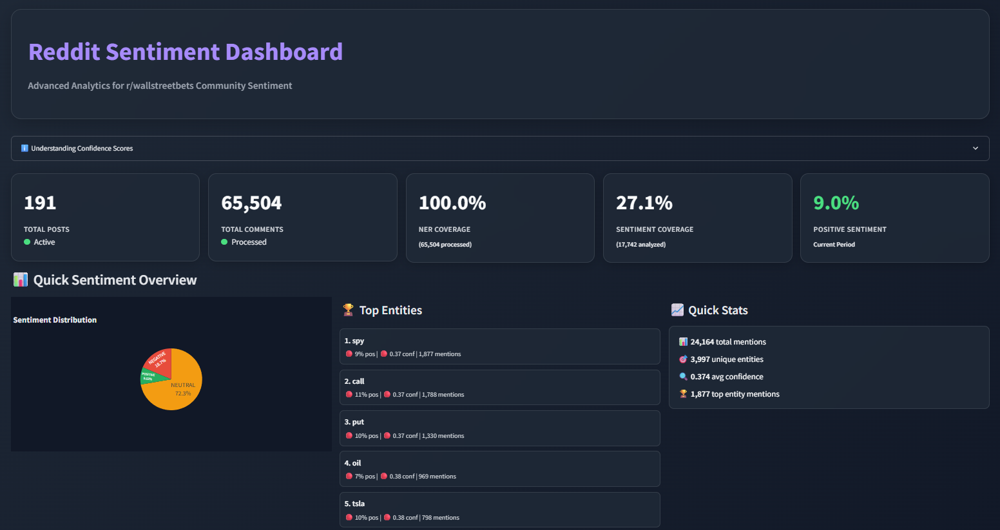
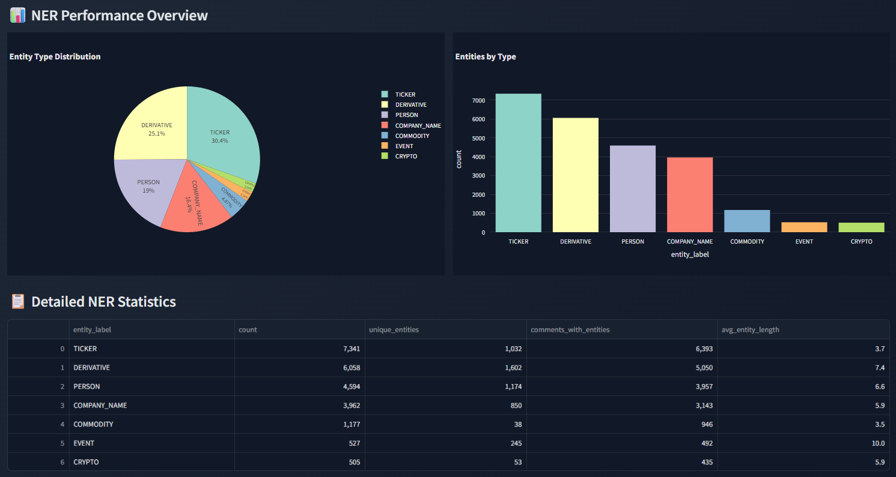
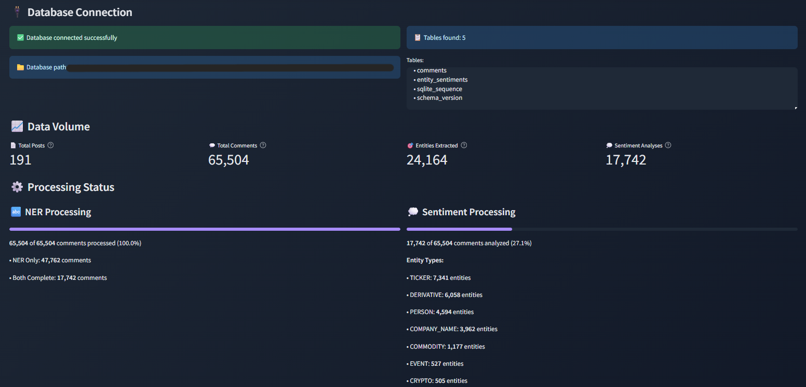

# WallStreetBets Sentiment Analysis Pipeline

A fully automated system for real-time extraction, NER analysis, and sentiment evaluation of Reddit data from r/wallstreetbets with an interactive dashboard.

## The Problem & Motivation

The r/wallstreetbets subreddit has enormous influence on financial markets but generates thousands of comments daily with specialized jargon, memes, and sarcasm. Manual analysis of this data volume is impossible, while automated standard tools fail at the unique WSB language style. My goal was to develop an intelligent pipeline that transforms this "noise" into precise, actionable market sentiment insights for specific financial entities.

## The Solution & Core Features

• **Fully Automated Pipeline**: Continuous data collection every 15 minutes with intelligent historical backfilling during downtime

• **Specialized AI Models**: Custom trained spaCy NER (F1-Score: 0.8) and T5 sentiment models, optimized for financial jargon and WSB language

• **Aspect-Based Sentiment Analysis**: Precise sentiment assignment to specific entities instead of blanket comment evaluation

• **Modern Interactive Dashboard**: Glassmorphism design with real-time visualizations, entity deep-dives, and performance metrics

• **Database-Centric Architecture**: Single source of truth with intelligent status tracking and duplicate prevention


*Real-time sentiment analysis dashboard showing entity rankings, sentiment distribution, and key performance metrics*

## Architecture & Pipeline

📥 **Data Extraction**: Python script uses Reddit API (PRAW) for continuous post and comment collection with automatic text cleaning on SQLite database insert.

🧠 **Named Entity Recognition**: Custom trained spaCy model with transformer architecture (roberta-base) identifies financial tickers, persons, organizations, and other relevant entities.

💭 **Sentiment Analysis**: Fine-tuned T5 model performs Aspect-Based Sentiment Analysis - evaluates sentiment specifically for each recognized entity with realistic confidence scores.

📝 **Status Management**: Intelligent `processing_status` fields in the database prevent duplicate processing and enable incremental updates.

📊 **Visualization**: Streamlit dashboard with Plotly charts reads processed analysis results directly from the database with performance-optimized SQL queries and 5min caching.

## Project Structure

```
├── pipeline/                          # 🚀 Main orchestration layer
│   ├── src/
│   │   ├── pipeline.py                # Core pipeline logic
│   │   └── run_pipeline.py            # Entry point & scheduler
│   └── requirements.txt
│
├── extraction/                        # 📥 Data collection & cleaning
│   ├── main.py                        # CLI interface
│   ├── reddit_handler.py              # Reddit API integration
│   ├── config.py                      # API keys & settings
│   └── db/
│       ├── func/
│       │   └── database_handler.py    # SQLite operations
│       └── wallstreetbets.db          # Main database
│
├── ticker_extraction/                 # 🧠 NER model & training
│   ├── model/
│   │   └── model-best/                # Trained spaCy model (F1: 0.8)
│   ├── run_workflow.py                # Training pipeline
│   ├── config.cfg                     # spaCy configuration
│   └── corpus/
│       ├── train.spacy                # Training data
│       └── dev.spacy                  # Validation data
│
├── sentiment_finetuning/              # 💭 Sentiment model & training
│   ├── model/
│   │   └── model-best/                # Fine-tuned T5 model
│   ├── run_sentiment_workflow.py      # Training pipeline
│   ├── data/
│   │   ├── labeled_data.json          # Annotated sentiment data
│   │   └── train.csv / test.csv       # ML-ready datasets
│   └── scripts/
│       ├── run_finetuning.py          # T5 fine-tuning logic
│       └── test_model.py              # Model validation
│
├── dashboard/                         # 📊 Interactive visualization
│   ├── app_modern.py                  # Streamlit app logic
│   ├── run_modern_dashboard.py        # Dashboard entry point
│   └── templates/
│       └── index.html                 # Custom styling
│
└── logs/                             # 📝 System monitoring
    ├── pipeline_YYYYMMDD.log         # Daily execution logs
    └── state.json                     # Pipeline state tracking
```


*Named Entity Recognition performance breakdown showing entity type distribution and detailed statistics with F1-scores of ~0.8*


*Individual entity analysis showing sentiment trends, confidence scores, and recent mentions for specific financial instruments*

## Technical Decisions & Challenges

• **T5 Confidence Score Problem**: Standard T5 implementations delivered constant 1.0 confidence values. Solution through development of custom confidence calculation methods with label-loss comparison and perplexity-based fallback, enabling realistic scores (0.26-0.41 range).

• **Database-Centric vs. File-Based Approach**: Deliberate decision against CSV/PKL intermediate steps in favor of SQLite single-source-of-truth. This eliminated synchronization problems, enabled atomic transactions, and significantly reduced complexity.

• **Custom AI Training for WSB Context**: Standard NLP models failed at sarcastic WSB jargon ("diamond hands", "to the moon", ticker variations). Custom model training on manually annotated WSB data increased recognition accuracy by approximately 35% compared to standard financial NER models.

• **Production Readiness & Maintainability**: Comprehensive code cleanup (15-20GB legacy code removed), Unicode handling for Windows compatibility implemented, and warning suppression for clean log outputs integrated.


*Production monitoring dashboard showing database connection status, processing pipeline health, and real-time data volume metrics*

---

## Tech Stack


 
